# Slack_SNS_Integration

This project configures Slack with AWS SNS to push notifications to a Slack channel. Follow these steps to set up the integration.

---

## Prerequisites

- A Slack Workspace 
- AWS account access with permissions for SNS and Lambda

---

## Slack App Configuration

1. Go to the [Slack API website](https://api.slack.com/apps).

2. Click on **Create an App** and choose **From Scratch**.

   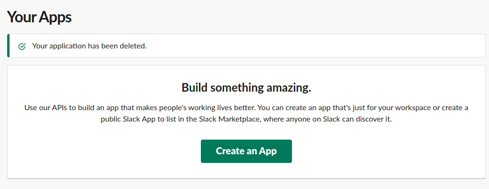

3. Name your app, select the Slack Workspace, and click **Create App**.

   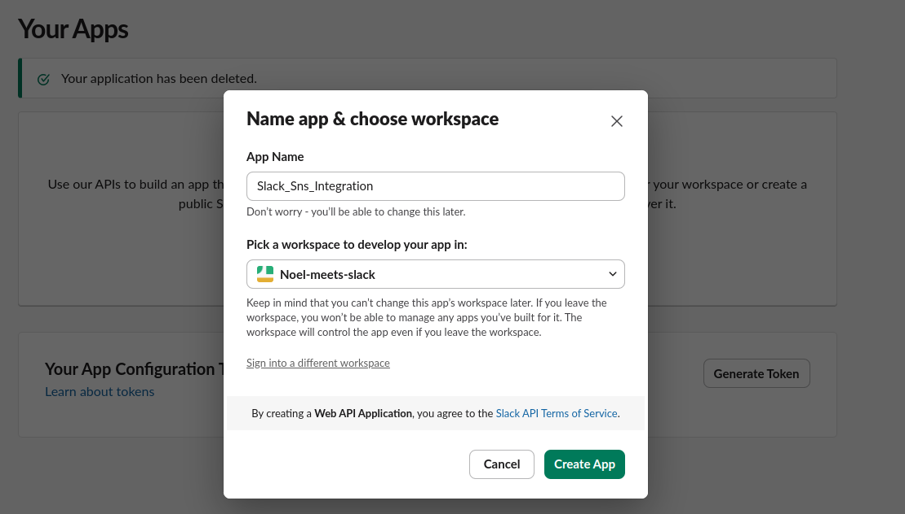

4. In the left menu, go to **Incoming Webhooks**.
   - Toggle **Activate Incoming Webhooks** to enable it.
   - Scroll down to **Add New Webhook to Workspace** and choose the channel that will receive SNS notifications.

   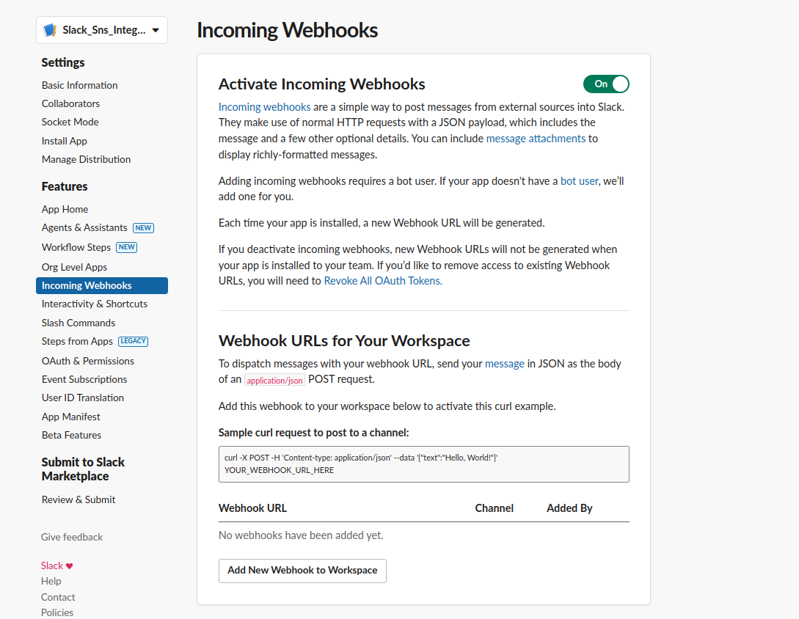

5. Copy the **Webhook URL** — you'll need this for the AWS Lambda function.

---

## Create an SNS Topic

1. In the AWS Console, navigate to **SNS**.

2. Create a new SNS Topic, choose **Standard** and assign **Name**.

   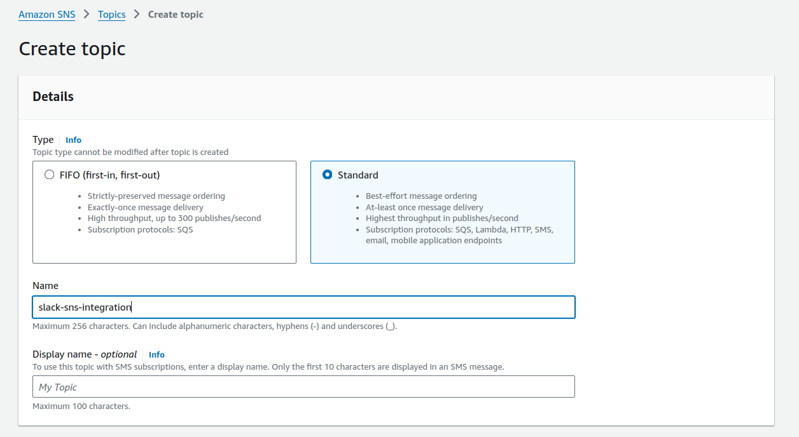

3. Note the SNS Topic ARN; you’ll use this in the Lambda setup.

---

## Lambda Function Setup

1. In the AWS Console, go to **Lambda** and click **Create function**.
   - Set the function name.
   - Choose **Python 3.10** as the runtime.

   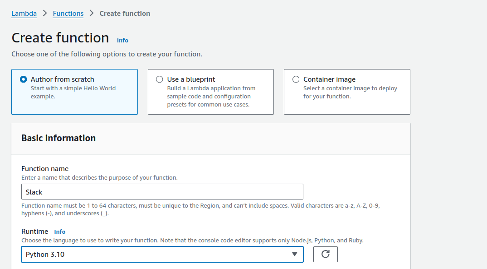

2. In the **Code** section of the Lambda function, paste the code from `lambda_function.py`.
   - Ensure the webhook URL from Slack is included in your code to send messages to the Slack channel.
   - Click **Deploy**.

   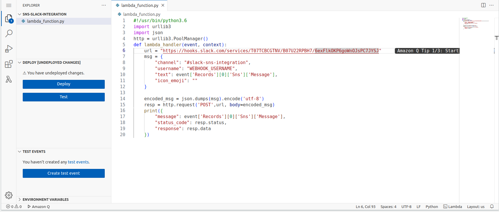

3. Create a test event:
   - Name the event and select **SNS Topic Notification**.

   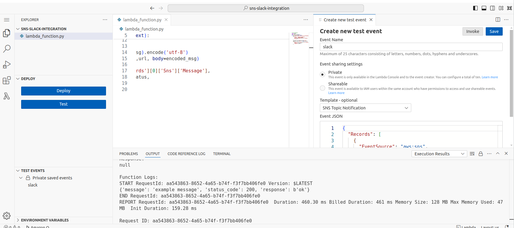

4. In **Triggers**, add an **SNS** trigger and select the SNS Topic you created earlier.

   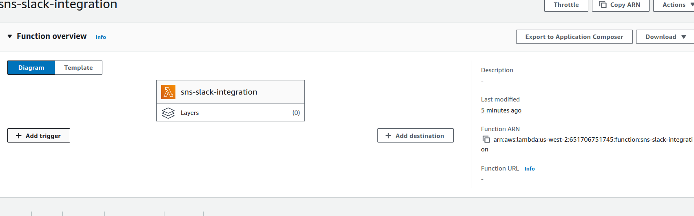

   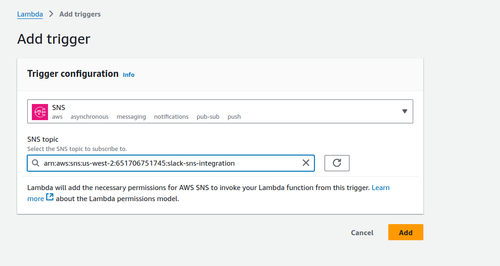

---

## Testing the Integration

1. In the Lambda console, click **Test** to trigger the function.

   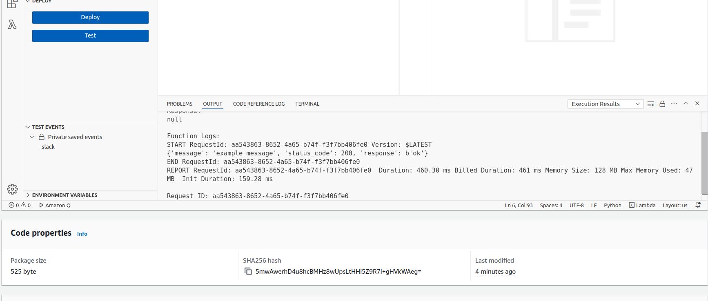

2. Check your Slack channel for the test message sent from AWS SNS.

   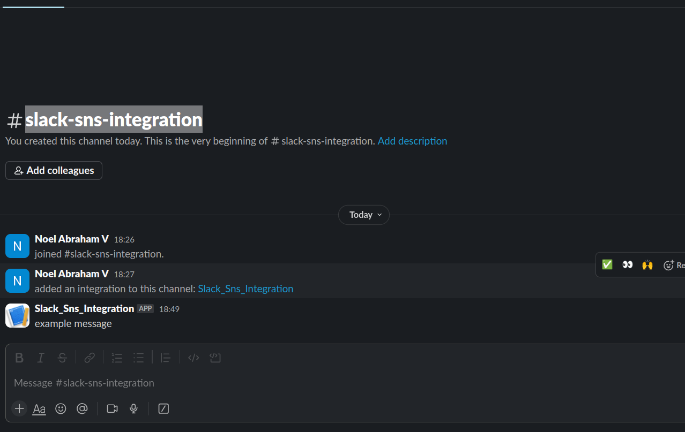

---

## Troubleshooting

- Ensure the Webhook URL is correct in the Lambda code.
- Verify that the Lambda function has the necessary permissions to publish to SNS.
- If no message appears in Slack, check the Lambda CloudWatch logs for error details.

---

This guide should help you successfully set up SNS to send notifications to Slack!
